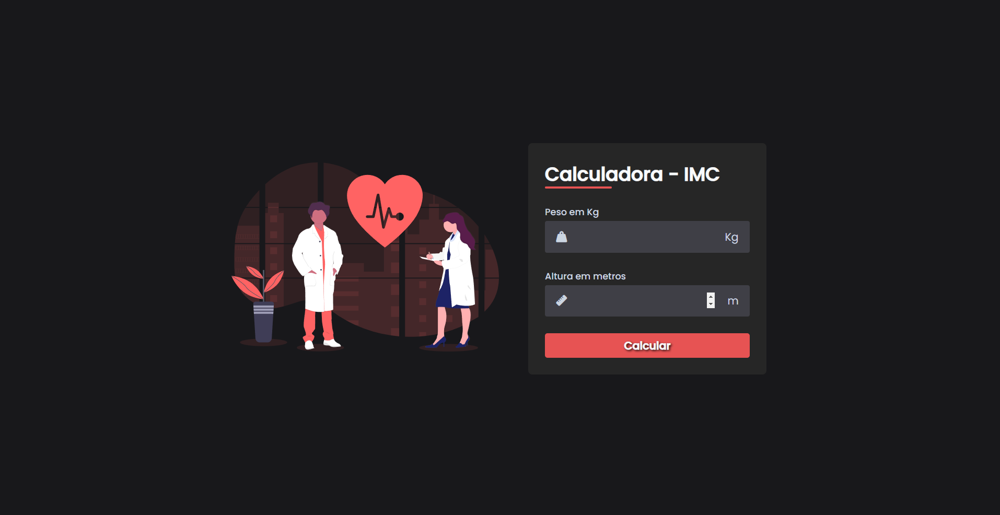

# Calculadora IMC
 

Deploy: (https://calculadoraimc-five.vercel.app/)

## Sobre

É uma calculadora que dá o resultado de índice de massa corpórea, calculo que é feito com base na altura e peso. É um excelente método para ter uma noção do seu peso ideal. Projeto feito com os créditos a Larissa Kich, pois pude realizar e aprender com o vídeo que está no canal dela (https://www.youtube.com/@larissakich).

### Objetivos

Praticar minhas habilidades de HTML, CSS e JS.

### Desafios

Desenvolver meus conhecimento de Javascript.

### Conclusão

Depois de um tempo parado por causa da minha mudança para Portugal, retorno agpra aos meus estudos de Desenvolvimento Front-end. Este projeto foi o último que pratiquei com o vídeo da Larissa e lembro me gostei muito de praticá-lo. De agora em diante, irei me aprofundar mais nos estudos e ir mais devagar com as práticas de projetos em vídeo e desenvolver pequenas coisas, como botões e interações com JS, pois irei estuda com os livros e aulas online.

### Marcação & Linguagem

- HTML
- CSS
- Javascript
